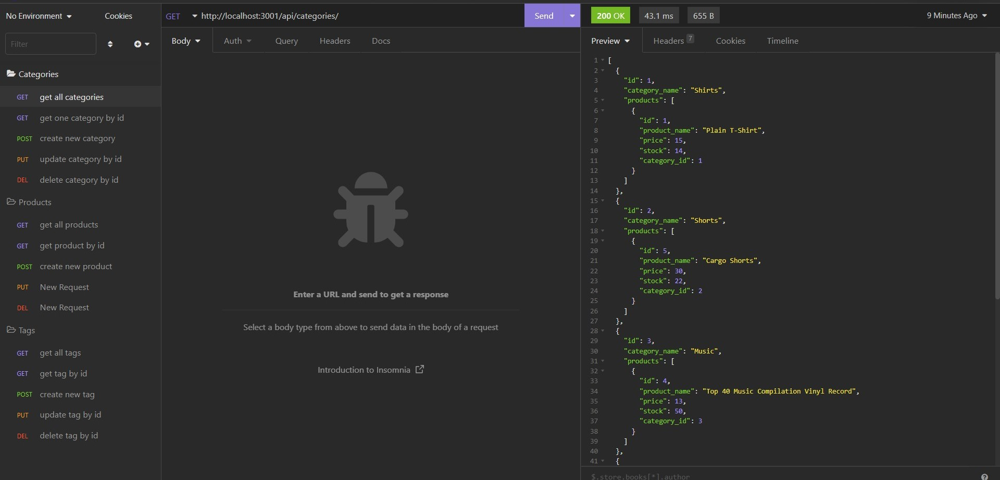

# E-Commerce Back-End

## Description

This project is the back-end server side code of an e-commerce application. The program uses Express.js, MySQL, and Sequelize to get, create, update, and delete data from a database whenever a request has been sent. This is known as CRUD (Create, Read, Update, Delete) and all of the routes follow this functionality.

The database used is stored using MySQL and has three tables: Category, Product, and Tag. A category can have many products, while products can have many tags. Tags can also have multiple products. The database stores this data and relates matching ids to link the tables together with overlapping information.

The program is used to access the database and return back data based on the request being made. It can get information, create new values, update existing values, and delete any value by its unique id number. This helps keep track of all the categories, products, and tags whenever they need to be updated!

## Process

After the database has been created on MySQL and seeded with data, the program can be run using ``npm start`` or ``node server.js`` to start connecting to the database and to start up the localhost server. To test the program, I used Insomnia to make my API requests.

API requests can be made either to the categories (`'/api/categories'`), products (`'/api/products'`), or tags (`'/api/tags'`). The program uses Sequelize to create Models of these tables.

- The **Category** model has a unique id and a category_name
- The **Tag** model has a unique id and a tag_name
- The **Product** model has a unique id, product_name, price, stock, and category_id. The category_id references the unique id from the Category model
- There is also a **ProductTag** model that relates both the Product and Tag models in a many-to-many relationship; products can have many tags, and tags can have many products.

Each route can do five requests: ``GET`` all data, ``GET`` one entry by id, ``POST`` (create) a new entry, ``PUT`` (update) an existing entry, and ``DELETE`` an entry. Each request returns a json response depending on if the data exists or not. The database is updated whenever a ``POST``, ``PUT`` or ``DELETE`` request has been made.

## Links

Link to a walkthrough video detailing the app: [https://drive.google.com/file/d/1Pzzf2yqsuWIRQShaVV64HymDSWjjh6Ou/view](https://drive.google.com/file/d/1Pzzf2yqsuWIRQShaVV64HymDSWjjh6Ou/view)

Link to GitHub repository: [https://github.com/cindyung56/ecommerce-backend](https://github.com/cindyung56/ecommerce-backend)